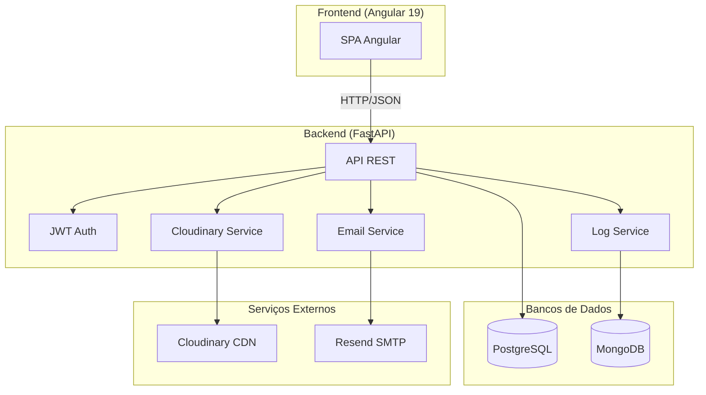
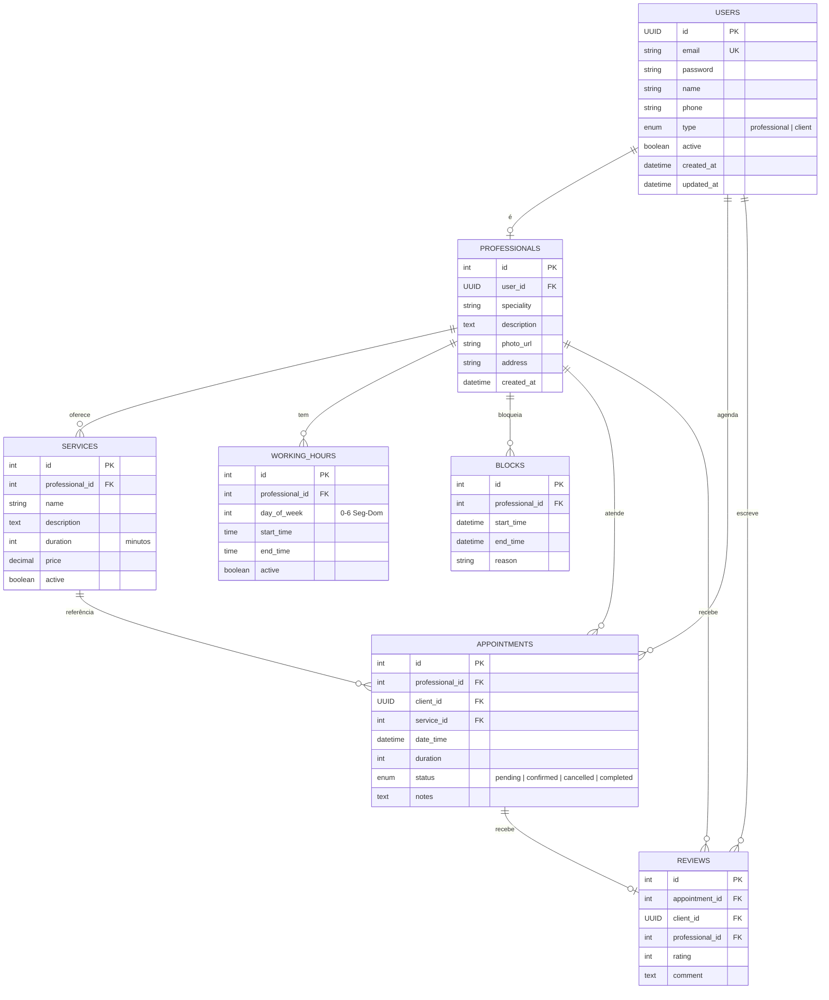
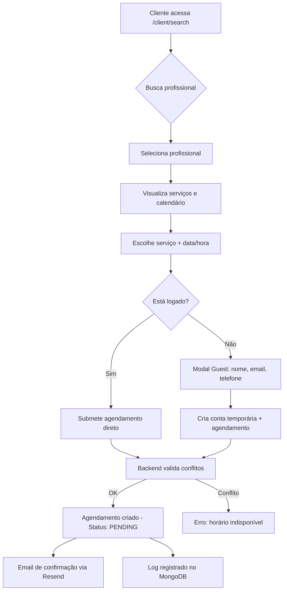
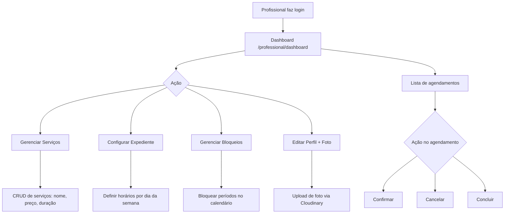
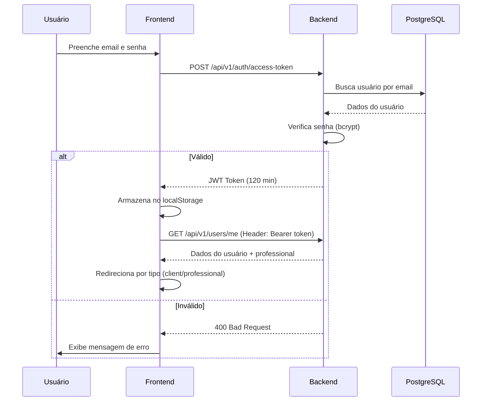

# Sistema de Agendamento de Serviços

Uma aplicação voltada para agendamentos de horários para serviços, desenvolvida para ser um projeto desafiador e interessante. O sistema é voltado para profissionais que precisam disponibilizar sua agenda para que clientes possam acessar e marcar horários de forma simples e eficiente.

## 🎯 Features

- **Cadastro e Autenticação** — Registro de usuários (clientes e profissionais) com autenticação JWT.
- **Busca de Profissionais** — Pesquisa pública por nome ou especialidade, sem necessidade de login.
- **Agendamento Online** — Clientes logados ou visitantes (modo "Guest") podem reservar horários disponíveis.
- **Painel do Profissional** — Dashboard com visão dos agendamentos, gerenciamento de serviços, expedientes e bloqueios.
- **Upload de Foto** — Profissionais podem enviar foto de perfil via Cloudinary (crop automático, otimização).
- **Notificações por Email** — Confirmações de agendamento enviadas automaticamente via Resend.
- **Logs Estruturados** — Sistema de auditoria persistido em MongoDB, registrando ações críticas (login, erros, emails).
- **Docker Compose** — Ambiente de desenvolvimento completo com hot reload.
- **Deploy Cloud** — Configuração pronta para Vercel (frontend) e Railway (backend).

---

## 🏗 Arquitetura



### Stack Tecnológica

| Camada        | Tecnologia            | Papel                        |
| ------------- | --------------------- | ---------------------------- |
| Frontend      | Angular 19+           | SPA com Angular Material     |
| Backend       | FastAPI (Python 3.11) | API REST assíncrona          |
| ORM           | SQLAlchemy 2.0        | Mapeamento objeto-relacional |
| Migrations    | Alembic               | Versionamento de schema      |
| DB Relacional | PostgreSQL 15         | Dados de negócio             |
| DB NoSQL      | MongoDB 7.0           | Logs e auditoria             |
| Auth          | JWT (python-jose)     | Tokens de acesso             |
| Emails        | Resend                | Notificações transacionais   |
| Imagens       | Cloudinary            | CDN de fotos de perfil       |
| Infra Local   | Docker Compose        | Orquestração de containers   |
| Prod Frontend | Vercel                | CDN + Static Hosting         |
| Prod Backend  | Railway               | PaaS com PostgreSQL          |

---

## 📊 Diagrama ER (Entidade-Relacionamento)



---

## 🔄 Fluxos da Aplicação

### Fluxo de Agendamento (Cliente)



### Fluxo do Profissional



### Fluxo de Autenticação



---

## 📂 Estrutura do Projeto

```
/
├── backend/
│   ├── app/
│   │   ├── api/v1/endpoints/   # 12 routers (auth, users, professionals, services, ...)
│   │   ├── core/               # Config, database, security, enums, logging, cloudinary
│   │   ├── models/             # 7 modelos SQLAlchemy
│   │   ├── schemas/            # Validação Pydantic (request/response)
│   │   ├── services/           # Email service (Resend)
│   │   ├── templates/          # Template HTML do email
│   │   └── main.py             # Entry point FastAPI
│   ├── Dockerfile              # Build de produção (multistage)
│   ├── Dockerfile.dev          # Build de desenvolvimento (hot reload)
│   ├── Procfile                # Gunicorn para Railway
│   └── requirements.txt
├── frontend/
│   ├── src/app/
│   │   ├── core/               # Guards, interceptors, services, models
│   │   ├── features/
│   │   │   ├── client/         # Search, Booking, Appointments, Settings
│   │   │   ├── professional/   # Dashboard, Services, Blocks, Settings
│   │   │   └── common/         # Register
│   │   └── login/              # Tela de login
│   ├── Dockerfile              # Build de produção (nginx)
│   ├── Dockerfile.dev          # Build de desenvolvimento
│   └── nginx.conf              # Proxy reverso (produção)
├── docker/
│   └── mongo/init-log-db.js    # Script de init do MongoDB
├── postman/                    # Coleção Postman exportada
├── docker-compose.yml          # Dev environment
├── vercel.json                 # Deploy frontend (Vercel)
└── .env.example                # Modelo de variáveis de ambiente
```

---

## 🔌 Endpoints da API

Todos prefixados com `/api/v1`. Documentação interativa completa em `/docs` (Swagger).

| Grupo             | Método | Rota                        | Descrição                                            | Auth  |
| ----------------- | ------ | --------------------------- | ---------------------------------------------------- | ----- |
| **Auth**          | POST   | `/auth/access-token`        | Login (retorna JWT)                                  | ❌    |
| **Users**         | GET    | `/users/`                   | Listar usuários                                      | ✅    |
|                   | POST   | `/users/`                   | Criar usuário                                        | ❌    |
|                   | GET    | `/users/me`                 | Dados do usuário logado                              | ✅    |
|                   | PUT    | `/users/{id}`               | Atualizar usuário                                    | ✅    |
| **Professionals** | GET    | `/professionals/`           | Listar profissionais (filtro por nome/especialidade) | ❌    |
|                   | GET    | `/professionals/{id}`       | Detalhes do profissional                             | ❌    |
|                   | PUT    | `/professionals/{id}`       | Atualizar perfil                                     | ✅ 🔒 |
| **Services**      | GET    | `/services/`                | Listar serviços (por profissional)                   | ❌    |
|                   | POST   | `/services/`                | Criar serviço                                        | ✅ 🔒 |
|                   | PUT    | `/services/{id}`            | Atualizar serviço                                    | ✅ 🔒 |
|                   | DELETE | `/services/{id}`            | Remover serviço                                      | ✅ 🔒 |
| **Appointments**  | POST   | `/appointments/`            | Criar agendamento                                    | ✅    |
|                   | GET    | `/appointments/`            | Listar agendamentos                                  | ✅    |
|                   | PATCH  | `/appointments/{id}/status` | Alterar status                                       | ✅ 🔒 |
| **Guest**         | POST   | `/guest-appointments/`      | Agendamento sem login                                | ❌    |
| **Working Hours** | GET    | `/working-hours/`           | Horários de expediente                               | ❌    |
|                   | POST   | `/working-hours/batch`      | Salvar horários em lote                              | ✅ 🔒 |
| **Blocks**        | GET    | `/blocks/`                  | Listar bloqueios                                     | ❌    |
|                   | POST   | `/blocks/`                  | Criar bloqueio                                       | ✅ 🔒 |
|                   | DELETE | `/blocks/{id}`              | Remover bloqueio                                     | ✅ 🔒 |
| **Upload**        | POST   | `/upload/photo`             | Upload de foto (Cloudinary)                          | ✅ 🔒 |
| **Logs**          | POST   | `/logs/frontend`            | Receber logs do frontend                             | ❌    |
| **Health**        | GET    | `/health`                   | Status do serviço                                    | ❌    |

> ✅ = Requer JWT | 🔒 = Requer role `professional`

---

## ⚙️ Variáveis de Ambiente

| Variável                | Descrição                               | Obrigatória |
| ----------------------- | --------------------------------------- | :---------: |
| `DATABASE_URL`          | Connection string PostgreSQL            |     ✅      |
| `SECRET_KEY`            | Chave secreta para JWT (hex 32 bytes)   |     ✅      |
| `POSTGRES_USER`         | Usuário do PostgreSQL (Docker local)    |   Docker    |
| `POSTGRES_PASSWORD`     | Senha do PostgreSQL (Docker local)      |   Docker    |
| `POSTGRES_DB`           | Nome do banco PostgreSQL                |   Docker    |
| `MONGO_ROOT_USER`       | Usuário root do MongoDB (Docker local)  |   Docker    |
| `MONGO_ROOT_PASSWORD`   | Senha root do MongoDB (Docker local)    |   Docker    |
| `LOG_MONGO_USER`        | Usuário do MongoDB para logs            |     ✅      |
| `LOG_MONGO_PASSWORD`    | Senha do MongoDB para logs              |     ✅      |
| `LOG_MONGO_URI`         | URI de conexão MongoDB (Atlas ou local) |     ✅      |
| `LOG_DB_NAME`           | Nome do banco de logs                   |     ✅      |
| `LOG_LEVEL`             | Nível de log (`debug`, `info`, `warn`)  |     ❌      |
| `RESEND_API_KEY`        | API Key do Resend                       |     ❌      |
| `EMAILS_FROM_ADDRESS`   | Email remetente                         |     ❌      |
| `EMAILS_ENABLED`        | Habilitar envio de emails               |     ❌      |
| `CLOUDINARY_CLOUD_NAME` | Cloud Name do Cloudinary                |     ❌      |
| `CLOUDINARY_API_KEY`    | API Key do Cloudinary                   |     ❌      |
| `CLOUDINARY_API_SECRET` | API Secret do Cloudinary                |     ❌      |
| `BACKEND_CORS_ORIGINS`  | Lista JSON de origens permitidas        |     ❌      |
| `ENVIRONMENT`           | `development` ou `production`           |     ❌      |

---

## 🛠️ Como Executar (Desenvolvimento Local)

### Pré-requisitos

- [Docker](https://www.docker.com/) e [Docker Compose](https://docs.docker.com/compose/)

### Passo a Passo

```bash
# 1. Clone o repositório
git clone https://github.com/felipe-gomes0/astrocode-teste.git
cd astrocode-teste

# 2. Configure as variáveis de ambiente
cp .env.example .env
# Edite o .env com suas credenciais (Resend, Cloudinary são opcionais)

# 3. Inicie a aplicação
docker compose up --build

# 4. Popule o banco com dados de teste (em outro terminal)
docker compose exec backend python -m app.initial_data
```

### Acessos

| Serviço     | URL                                                      |
| ----------- | -------------------------------------------------------- |
| Frontend    | [http://localhost:4200](http://localhost:4200)           |
| API Swagger | [http://localhost:8000/docs](http://localhost:8000/docs) |
| PostgreSQL  | `localhost:5432`                                         |
| MongoDB     | `localhost:27017`                                        |

### Contas de Teste (após seed)

| Email                         | Senha         | Tipo                            |
| ----------------------------- | ------------- | ------------------------------- |
| `prof@example.com`            | `password123` | Profissional (Barbeiro)         |
| `ana.dentista@example.com`    | `password123` | Profissional (Dentista)         |
| `rafael.personal@example.com` | `password123` | Profissional (Personal Trainer) |
| `carla.psicologa@example.com` | `password123` | Profissional (Psicóloga)        |
| `client@example.com`          | `password123` | Cliente                         |
| `maria@example.com`           | `password123` | Cliente                         |

---

## 🚀 Deploy em Produção

### Infraestrutura Cloud

| Serviço              | Plataforma    | Tier             |
| -------------------- | ------------- | ---------------- |
| Frontend             | Vercel        | Free             |
| Backend + PostgreSQL | Railway       | Free / Hobby     |
| MongoDB (Logs)       | MongoDB Atlas | Free (M0, 512MB) |

### Passos

1. **MongoDB Atlas** — Criar cluster M0 gratuito, criar usuário e copiar a connection string.
2. **Railway** — Importar repo do GitHub (`Root Directory: backend`), adicionar PostgreSQL, configurar variáveis de ambiente (`DATABASE_URL`, `SECRET_KEY`, `LOG_MONGO_URI`, etc.), gerar domínio público.
3. **Frontend** — Editar `frontend/src/environments/environment.production.ts` com a URL do Railway. Importar no Vercel (`Root Directory: frontend`).
4. **CORS** — No Railway, setar `BACKEND_CORS_ORIGINS=["https://seu-app.vercel.app"]`.

---

## 🗃️ Coleção Postman

Importe `postman/collections/Astrocode Teste API.postman_collection.json` no Postman. A variável `base_url` está pré-configurada para `http://localhost:8000`. Para produção, altere para a URL do Railway.

---

## 🐳 Comandos Úteis

```bash
# Parar e limpar volumes
docker compose down -v

# Rebuild completo
docker compose up --build --force-recreate

# Logs do backend em tempo real
docker compose logs -f backend

# Rodar migrations
docker compose exec backend alembic upgrade head

# Re-popular o banco
docker compose exec backend python -m app.initial_data
```
